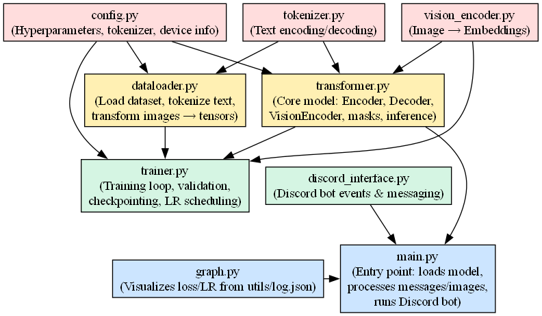

---

# Neura

This repository contains the AI Vtuber named Neura

---

# AI Model Roadmap

### **Phase 1: Core Chatbot**

1. Build an encoder-decoder transformer
2. Develop a custom dataset loader
3. Implement a BPE Tokenizer

   * Tokenization: words ⇄ tokens
   * Trainer for tokenizer
4. Create a training and inference script
5. Add `config.py` for model configurations

---

### **Phase 2: Voice Interface**

* Add speech-to-text (STT) input
* Add text-to-speech (TTS) output

---
### **Phase 3: (RAG-based with FAISS)**
* Somehow add Rag capablities to the model
* Add FAISS for faster RAG

---
### **Phase 4: Add sentiments**
Add Emotion Embeddings

   * For user mood and bot mood
   * Inject into decoder or fusion

Condition response on emotion
   * Bot replies happily/sadly etc.

Build Reflex Generator Module
   * Custom train the model to generate appopriate responses

Update Inference Pipeline
   * If bot says something flagged → run reflex generator → append apology
---
### **Phase 5: Vision Integration**

* Add image recognition capabilities
* Upgrade to live screen feed processing

---

# Project Structure

```
/PROJECT_EXHIBITION
├── main.py                     # Orchestrator: runs vision + model + voice
├── trainer.py                  # Training loop for text + multimodal
│
├── model/
│   ├── transformer.py          # Encoder–decoder backbone
│   ├── vision_encoder.py       # Wrapper: ViT/Swin/ConvNeXt → embeddings
│   ├── tokenizer.py            # Custom BPE
│   ├── inference.py            # generate(), beam search, structured response
│   └── reflex_generator.py     # Optional rule-based fallback
│
├── voice/
│   ├── stt.py                  # Speech → text
│   └── tts.py                  # Text → speech
│
├── vision/
│   ├── screen_reader.py        # Webcam / screen capture
│   ├── preprocess.py           # Resize, normalize, augmentation
│   └── ocr.py                  # (optional) text from screen for context
│
├── utils/
│   ├── config.py               # JSON config handler
│   ├── emotion_control.py      # Inject tokens to control bot mood
│   ├── output_parser.py        # Validate chatbot output (JSON/text)
│   └── datasets/               # Dataset loaders (text / multimodal)


```

---

# Data Flow Overview
```

```
---

```
[Image] ─► Image Encoder (CNN / ViT)
                  ↓
             Image Embeddings  ─┐
                                │
[Text Input] ─► BPE Tokenizer ─►Text Encoder ─┐
                                              │
[User Emotion ID] ─► Emotion Embedding ───────┤
[Bot Emotion ID ] ─► Emotion Embedding ───────┘
                                              ↓
                                  Fusion Module / Attention
                                              ↓
                                           Decoder
                                              ↓
     ┌─────────────────────────────────────────────────────────┐
     │     Structured Output (as JSON):                        │
     │                                                         │
     │  {                                                      │
     │    "output": "I'm sorry, that was rude of me.",         │
     │    "emotion": "ashamed",                                │
     │    "motion": { "expression": "sad", "intensity": 0.8 }, │
     │    "toggles": { "sweat": true }                         │
     │  }                                                      │
     └─────────────────────────────────────────────────────────┘
                     ↓
      Send output to VTube Studio / UI / Speech TTS

```

---
# Model Output Format

Normal response:
```
Input:
"What is your name?"

Output:
{
  "output": "My name is josh!",
  "emotion": "Excited",
  "motion": { "expression": "excited", "intensity": 0.8 },
  "toggles": { "sweat": False,"Excited":True }
}

```

Reflex response:

```
Input:
"You made a mistake!"

Output:
{
  "output": "I'm sorry, that was rude of me.",
  "emotion": "ashamed",
  "motion": { "expression": "sad", "intensity": 0.8 },
  "toggles": { "sweat": true }
}
```

---
# Ideal HyperParams

```
# General
learning_rate      = 3e-4
weight_decay       = 0.01
warmup_steps       = 500
num_epochs         = 3–5
batch_size         = 4  # increase if enough VRAM

# Gradient
gradient_accumulation_steps = 4  # simulates bigger batch

# Model
max_seq_len        = 256–512
vocab_size         = len(tokenizer.vocab)
embedding_dim      = 256 or 512
num_layers         = 6–8
num_heads          = 4–8

# Optimization
scheduler          = "cosine"
fp16               = True (if GPU)
```
