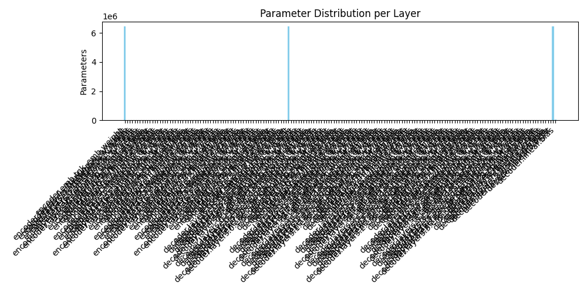
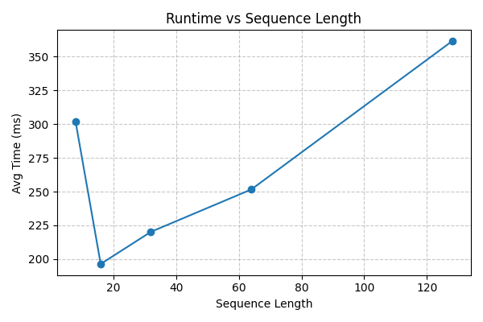
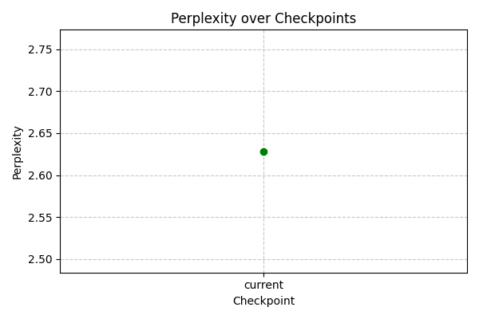
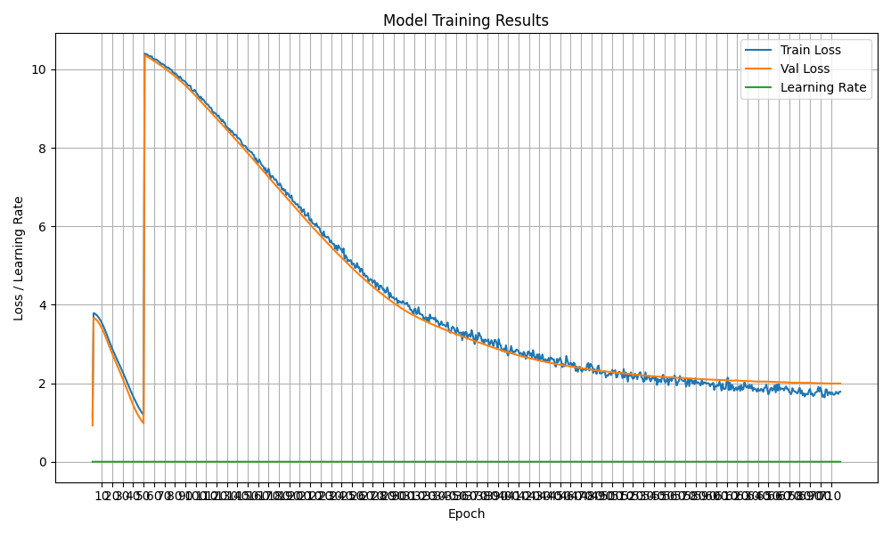

# Model Analysis Report

- Total Parameters: 20,411,988
- Estimated Size  : 77.87 MB
- Device          : cpu
- Checkpoint      : best_model.pt
- Avg Gen Time    : 224.08 ms
- Throughput      : 4.46 seq/s
- Validation PPL  : 2.63

## Model Parameter Breakdown

|   # | Layer Name                                         | Param Count   | Size        | DType   |
|-----|----------------------------------------------------|---------------|-------------|---------|
|   1 | encoder.emb.tok_emb.weight                         | 6,433,280     | 25130.00 KB | float32 |
|   2 | encoder.layers.0.attention.w_q.weight              | 16,384        | 64.00 KB    | float32 |
|   3 | encoder.layers.0.attention.w_q.bias                | 128           | 0.50 KB     | float32 |
|   4 | encoder.layers.0.attention.w_k.weight              | 16,384        | 64.00 KB    | float32 |
|   5 | encoder.layers.0.attention.w_k.bias                | 128           | 0.50 KB     | float32 |
|   6 | encoder.layers.0.attention.w_v.weight              | 16,384        | 64.00 KB    | float32 |
|   7 | encoder.layers.0.attention.w_v.bias                | 128           | 0.50 KB     | float32 |
|   8 | encoder.layers.0.attention.w_concat.weight         | 16,384        | 64.00 KB    | float32 |
|   9 | encoder.layers.0.attention.w_concat.bias           | 128           | 0.50 KB     | float32 |
|  10 | encoder.layers.0.norm1.gamma                       | 128           | 0.50 KB     | float32 |
|  11 | encoder.layers.0.norm1.beta                        | 128           | 0.50 KB     | float32 |
|  12 | encoder.layers.0.ffn.linear1.weight                | 16,384        | 64.00 KB    | float32 |
|  13 | encoder.layers.0.ffn.linear1.bias                  | 128           | 0.50 KB     | float32 |
|  14 | encoder.layers.0.ffn.linear2.weight                | 16,384        | 64.00 KB    | float32 |
|  15 | encoder.layers.0.ffn.linear2.bias                  | 128           | 0.50 KB     | float32 |
|  16 | encoder.layers.0.norm2.gamma                       | 128           | 0.50 KB     | float32 |
|  17 | encoder.layers.0.norm2.beta                        | 128           | 0.50 KB     | float32 |
|  18 | encoder.layers.1.attention.w_q.weight              | 16,384        | 64.00 KB    | float32 |
|  19 | encoder.layers.1.attention.w_q.bias                | 128           | 0.50 KB     | float32 |
|  20 | encoder.layers.1.attention.w_k.weight              | 16,384        | 64.00 KB    | float32 |
|  21 | encoder.layers.1.attention.w_k.bias                | 128           | 0.50 KB     | float32 |
|  22 | encoder.layers.1.attention.w_v.weight              | 16,384        | 64.00 KB    | float32 |
|  23 | encoder.layers.1.attention.w_v.bias                | 128           | 0.50 KB     | float32 |
|  24 | encoder.layers.1.attention.w_concat.weight         | 16,384        | 64.00 KB    | float32 |
|  25 | encoder.layers.1.attention.w_concat.bias           | 128           | 0.50 KB     | float32 |
|  26 | encoder.layers.1.norm1.gamma                       | 128           | 0.50 KB     | float32 |
|  27 | encoder.layers.1.norm1.beta                        | 128           | 0.50 KB     | float32 |
|  28 | encoder.layers.1.ffn.linear1.weight                | 16,384        | 64.00 KB    | float32 |
|  29 | encoder.layers.1.ffn.linear1.bias                  | 128           | 0.50 KB     | float32 |
|  30 | encoder.layers.1.ffn.linear2.weight                | 16,384        | 64.00 KB    | float32 |
|  31 | encoder.layers.1.ffn.linear2.bias                  | 128           | 0.50 KB     | float32 |
|  32 | encoder.layers.1.norm2.gamma                       | 128           | 0.50 KB     | float32 |
|  33 | encoder.layers.1.norm2.beta                        | 128           | 0.50 KB     | float32 |
|  34 | encoder.layers.2.attention.w_q.weight              | 16,384        | 64.00 KB    | float32 |
|  35 | encoder.layers.2.attention.w_q.bias                | 128           | 0.50 KB     | float32 |
|  36 | encoder.layers.2.attention.w_k.weight              | 16,384        | 64.00 KB    | float32 |
|  37 | encoder.layers.2.attention.w_k.bias                | 128           | 0.50 KB     | float32 |
|  38 | encoder.layers.2.attention.w_v.weight              | 16,384        | 64.00 KB    | float32 |
|  39 | encoder.layers.2.attention.w_v.bias                | 128           | 0.50 KB     | float32 |
|  40 | encoder.layers.2.attention.w_concat.weight         | 16,384        | 64.00 KB    | float32 |
|  41 | encoder.layers.2.attention.w_concat.bias           | 128           | 0.50 KB     | float32 |
|  42 | encoder.layers.2.norm1.gamma                       | 128           | 0.50 KB     | float32 |
|  43 | encoder.layers.2.norm1.beta                        | 128           | 0.50 KB     | float32 |
|  44 | encoder.layers.2.ffn.linear1.weight                | 16,384        | 64.00 KB    | float32 |
|  45 | encoder.layers.2.ffn.linear1.bias                  | 128           | 0.50 KB     | float32 |
|  46 | encoder.layers.2.ffn.linear2.weight                | 16,384        | 64.00 KB    | float32 |
|  47 | encoder.layers.2.ffn.linear2.bias                  | 128           | 0.50 KB     | float32 |
|  48 | encoder.layers.2.norm2.gamma                       | 128           | 0.50 KB     | float32 |
|  49 | encoder.layers.2.norm2.beta                        | 128           | 0.50 KB     | float32 |
|  50 | encoder.layers.3.attention.w_q.weight              | 16,384        | 64.00 KB    | float32 |
|  51 | encoder.layers.3.attention.w_q.bias                | 128           | 0.50 KB     | float32 |
|  52 | encoder.layers.3.attention.w_k.weight              | 16,384        | 64.00 KB    | float32 |
|  53 | encoder.layers.3.attention.w_k.bias                | 128           | 0.50 KB     | float32 |
|  54 | encoder.layers.3.attention.w_v.weight              | 16,384        | 64.00 KB    | float32 |
|  55 | encoder.layers.3.attention.w_v.bias                | 128           | 0.50 KB     | float32 |
|  56 | encoder.layers.3.attention.w_concat.weight         | 16,384        | 64.00 KB    | float32 |
|  57 | encoder.layers.3.attention.w_concat.bias           | 128           | 0.50 KB     | float32 |
|  58 | encoder.layers.3.norm1.gamma                       | 128           | 0.50 KB     | float32 |
|  59 | encoder.layers.3.norm1.beta                        | 128           | 0.50 KB     | float32 |
|  60 | encoder.layers.3.ffn.linear1.weight                | 16,384        | 64.00 KB    | float32 |
|  61 | encoder.layers.3.ffn.linear1.bias                  | 128           | 0.50 KB     | float32 |
|  62 | encoder.layers.3.ffn.linear2.weight                | 16,384        | 64.00 KB    | float32 |
|  63 | encoder.layers.3.ffn.linear2.bias                  | 128           | 0.50 KB     | float32 |
|  64 | encoder.layers.3.norm2.gamma                       | 128           | 0.50 KB     | float32 |
|  65 | encoder.layers.3.norm2.beta                        | 128           | 0.50 KB     | float32 |
|  66 | decoder.emb.tok_emb.weight                         | 6,433,280     | 25130.00 KB | float32 |
|  67 | decoder.layers.0.self_attention.w_q.weight         | 16,384        | 64.00 KB    | float32 |
|  68 | decoder.layers.0.self_attention.w_q.bias           | 128           | 0.50 KB     | float32 |
|  69 | decoder.layers.0.self_attention.w_k.weight         | 16,384        | 64.00 KB    | float32 |
|  70 | decoder.layers.0.self_attention.w_k.bias           | 128           | 0.50 KB     | float32 |
|  71 | decoder.layers.0.self_attention.w_v.weight         | 16,384        | 64.00 KB    | float32 |
|  72 | decoder.layers.0.self_attention.w_v.bias           | 128           | 0.50 KB     | float32 |
|  73 | decoder.layers.0.self_attention.w_concat.weight    | 16,384        | 64.00 KB    | float32 |
|  74 | decoder.layers.0.self_attention.w_concat.bias      | 128           | 0.50 KB     | float32 |
|  75 | decoder.layers.0.norm1.gamma                       | 128           | 0.50 KB     | float32 |
|  76 | decoder.layers.0.norm1.beta                        | 128           | 0.50 KB     | float32 |
|  77 | decoder.layers.0.enc_dec_attention.w_q.weight      | 16,384        | 64.00 KB    | float32 |
|  78 | decoder.layers.0.enc_dec_attention.w_q.bias        | 128           | 0.50 KB     | float32 |
|  79 | decoder.layers.0.enc_dec_attention.w_k.weight      | 16,384        | 64.00 KB    | float32 |
|  80 | decoder.layers.0.enc_dec_attention.w_k.bias        | 128           | 0.50 KB     | float32 |
|  81 | decoder.layers.0.enc_dec_attention.w_v.weight      | 16,384        | 64.00 KB    | float32 |
|  82 | decoder.layers.0.enc_dec_attention.w_v.bias        | 128           | 0.50 KB     | float32 |
|  83 | decoder.layers.0.enc_dec_attention.w_concat.weight | 16,384        | 64.00 KB    | float32 |
|  84 | decoder.layers.0.enc_dec_attention.w_concat.bias   | 128           | 0.50 KB     | float32 |
|  85 | decoder.layers.0.norm2.gamma                       | 128           | 0.50 KB     | float32 |
|  86 | decoder.layers.0.norm2.beta                        | 128           | 0.50 KB     | float32 |
|  87 | decoder.layers.0.ffn.linear1.weight                | 16,384        | 64.00 KB    | float32 |
|  88 | decoder.layers.0.ffn.linear1.bias                  | 128           | 0.50 KB     | float32 |
|  89 | decoder.layers.0.ffn.linear2.weight                | 16,384        | 64.00 KB    | float32 |
|  90 | decoder.layers.0.ffn.linear2.bias                  | 128           | 0.50 KB     | float32 |
|  91 | decoder.layers.0.norm3.gamma                       | 128           | 0.50 KB     | float32 |
|  92 | decoder.layers.0.norm3.beta                        | 128           | 0.50 KB     | float32 |
|  93 | decoder.layers.1.self_attention.w_q.weight         | 16,384        | 64.00 KB    | float32 |
|  94 | decoder.layers.1.self_attention.w_q.bias           | 128           | 0.50 KB     | float32 |
|  95 | decoder.layers.1.self_attention.w_k.weight         | 16,384        | 64.00 KB    | float32 |
|  96 | decoder.layers.1.self_attention.w_k.bias           | 128           | 0.50 KB     | float32 |
|  97 | decoder.layers.1.self_attention.w_v.weight         | 16,384        | 64.00 KB    | float32 |
|  98 | decoder.layers.1.self_attention.w_v.bias           | 128           | 0.50 KB     | float32 |
|  99 | decoder.layers.1.self_attention.w_concat.weight    | 16,384        | 64.00 KB    | float32 |
| 100 | decoder.layers.1.self_attention.w_concat.bias      | 128           | 0.50 KB     | float32 |
| 101 | decoder.layers.1.norm1.gamma                       | 128           | 0.50 KB     | float32 |
| 102 | decoder.layers.1.norm1.beta                        | 128           | 0.50 KB     | float32 |
| 103 | decoder.layers.1.enc_dec_attention.w_q.weight      | 16,384        | 64.00 KB    | float32 |
| 104 | decoder.layers.1.enc_dec_attention.w_q.bias        | 128           | 0.50 KB     | float32 |
| 105 | decoder.layers.1.enc_dec_attention.w_k.weight      | 16,384        | 64.00 KB    | float32 |
| 106 | decoder.layers.1.enc_dec_attention.w_k.bias        | 128           | 0.50 KB     | float32 |
| 107 | decoder.layers.1.enc_dec_attention.w_v.weight      | 16,384        | 64.00 KB    | float32 |
| 108 | decoder.layers.1.enc_dec_attention.w_v.bias        | 128           | 0.50 KB     | float32 |
| 109 | decoder.layers.1.enc_dec_attention.w_concat.weight | 16,384        | 64.00 KB    | float32 |
| 110 | decoder.layers.1.enc_dec_attention.w_concat.bias   | 128           | 0.50 KB     | float32 |
| 111 | decoder.layers.1.norm2.gamma                       | 128           | 0.50 KB     | float32 |
| 112 | decoder.layers.1.norm2.beta                        | 128           | 0.50 KB     | float32 |
| 113 | decoder.layers.1.ffn.linear1.weight                | 16,384        | 64.00 KB    | float32 |
| 114 | decoder.layers.1.ffn.linear1.bias                  | 128           | 0.50 KB     | float32 |
| 115 | decoder.layers.1.ffn.linear2.weight                | 16,384        | 64.00 KB    | float32 |
| 116 | decoder.layers.1.ffn.linear2.bias                  | 128           | 0.50 KB     | float32 |
| 117 | decoder.layers.1.norm3.gamma                       | 128           | 0.50 KB     | float32 |
| 118 | decoder.layers.1.norm3.beta                        | 128           | 0.50 KB     | float32 |
| 119 | decoder.layers.2.self_attention.w_q.weight         | 16,384        | 64.00 KB    | float32 |
| 120 | decoder.layers.2.self_attention.w_q.bias           | 128           | 0.50 KB     | float32 |
| 121 | decoder.layers.2.self_attention.w_k.weight         | 16,384        | 64.00 KB    | float32 |
| 122 | decoder.layers.2.self_attention.w_k.bias           | 128           | 0.50 KB     | float32 |
| 123 | decoder.layers.2.self_attention.w_v.weight         | 16,384        | 64.00 KB    | float32 |
| 124 | decoder.layers.2.self_attention.w_v.bias           | 128           | 0.50 KB     | float32 |
| 125 | decoder.layers.2.self_attention.w_concat.weight    | 16,384        | 64.00 KB    | float32 |
| 126 | decoder.layers.2.self_attention.w_concat.bias      | 128           | 0.50 KB     | float32 |
| 127 | decoder.layers.2.norm1.gamma                       | 128           | 0.50 KB     | float32 |
| 128 | decoder.layers.2.norm1.beta                        | 128           | 0.50 KB     | float32 |
| 129 | decoder.layers.2.enc_dec_attention.w_q.weight      | 16,384        | 64.00 KB    | float32 |
| 130 | decoder.layers.2.enc_dec_attention.w_q.bias        | 128           | 0.50 KB     | float32 |
| 131 | decoder.layers.2.enc_dec_attention.w_k.weight      | 16,384        | 64.00 KB    | float32 |
| 132 | decoder.layers.2.enc_dec_attention.w_k.bias        | 128           | 0.50 KB     | float32 |
| 133 | decoder.layers.2.enc_dec_attention.w_v.weight      | 16,384        | 64.00 KB    | float32 |
| 134 | decoder.layers.2.enc_dec_attention.w_v.bias        | 128           | 0.50 KB     | float32 |
| 135 | decoder.layers.2.enc_dec_attention.w_concat.weight | 16,384        | 64.00 KB    | float32 |
| 136 | decoder.layers.2.enc_dec_attention.w_concat.bias   | 128           | 0.50 KB     | float32 |
| 137 | decoder.layers.2.norm2.gamma                       | 128           | 0.50 KB     | float32 |
| 138 | decoder.layers.2.norm2.beta                        | 128           | 0.50 KB     | float32 |
| 139 | decoder.layers.2.ffn.linear1.weight                | 16,384        | 64.00 KB    | float32 |
| 140 | decoder.layers.2.ffn.linear1.bias                  | 128           | 0.50 KB     | float32 |
| 141 | decoder.layers.2.ffn.linear2.weight                | 16,384        | 64.00 KB    | float32 |
| 142 | decoder.layers.2.ffn.linear2.bias                  | 128           | 0.50 KB     | float32 |
| 143 | decoder.layers.2.norm3.gamma                       | 128           | 0.50 KB     | float32 |
| 144 | decoder.layers.2.norm3.beta                        | 128           | 0.50 KB     | float32 |
| 145 | decoder.layers.3.self_attention.w_q.weight         | 16,384        | 64.00 KB    | float32 |
| 146 | decoder.layers.3.self_attention.w_q.bias           | 128           | 0.50 KB     | float32 |
| 147 | decoder.layers.3.self_attention.w_k.weight         | 16,384        | 64.00 KB    | float32 |
| 148 | decoder.layers.3.self_attention.w_k.bias           | 128           | 0.50 KB     | float32 |
| 149 | decoder.layers.3.self_attention.w_v.weight         | 16,384        | 64.00 KB    | float32 |
| 150 | decoder.layers.3.self_attention.w_v.bias           | 128           | 0.50 KB     | float32 |
| 151 | decoder.layers.3.self_attention.w_concat.weight    | 16,384        | 64.00 KB    | float32 |
| 152 | decoder.layers.3.self_attention.w_concat.bias      | 128           | 0.50 KB     | float32 |
| 153 | decoder.layers.3.norm1.gamma                       | 128           | 0.50 KB     | float32 |
| 154 | decoder.layers.3.norm1.beta                        | 128           | 0.50 KB     | float32 |
| 155 | decoder.layers.3.enc_dec_attention.w_q.weight      | 16,384        | 64.00 KB    | float32 |
| 156 | decoder.layers.3.enc_dec_attention.w_q.bias        | 128           | 0.50 KB     | float32 |
| 157 | decoder.layers.3.enc_dec_attention.w_k.weight      | 16,384        | 64.00 KB    | float32 |
| 158 | decoder.layers.3.enc_dec_attention.w_k.bias        | 128           | 0.50 KB     | float32 |
| 159 | decoder.layers.3.enc_dec_attention.w_v.weight      | 16,384        | 64.00 KB    | float32 |
| 160 | decoder.layers.3.enc_dec_attention.w_v.bias        | 128           | 0.50 KB     | float32 |
| 161 | decoder.layers.3.enc_dec_attention.w_concat.weight | 16,384        | 64.00 KB    | float32 |
| 162 | decoder.layers.3.enc_dec_attention.w_concat.bias   | 128           | 0.50 KB     | float32 |
| 163 | decoder.layers.3.norm2.gamma                       | 128           | 0.50 KB     | float32 |
| 164 | decoder.layers.3.norm2.beta                        | 128           | 0.50 KB     | float32 |
| 165 | decoder.layers.3.ffn.linear1.weight                | 16,384        | 64.00 KB    | float32 |
| 166 | decoder.layers.3.ffn.linear1.bias                  | 128           | 0.50 KB     | float32 |
| 167 | decoder.layers.3.ffn.linear2.weight                | 16,384        | 64.00 KB    | float32 |
| 168 | decoder.layers.3.ffn.linear2.bias                  | 128           | 0.50 KB     | float32 |
| 169 | decoder.layers.3.norm3.gamma                       | 128           | 0.50 KB     | float32 |
| 170 | decoder.layers.3.norm3.beta                        | 128           | 0.50 KB     | float32 |
| 171 | decoder.linear.weight                              | 6,433,280     | 25130.00 KB | float32 |
| 172 | decoder.linear.bias                                | 50,260        | 196.33 KB   | float32 |

## Graphs

